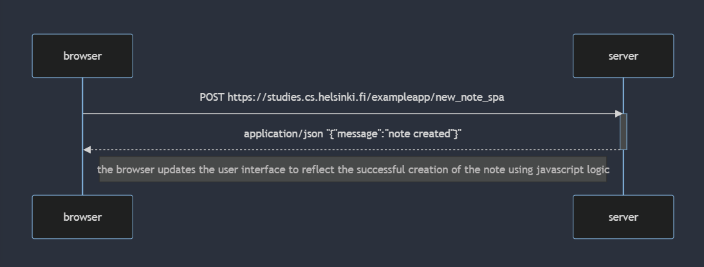

sequenceDiagram
    participant browser
    participant server

    browser->>server: POST https://studies.cs.helsinki.fi/exampleapp/new_note_spa
    activate server
    server-->>browser: application/json "{"message":"note created"}"
    deactivate server
    Note right of browser: the browser updates the user interface to reflect the successful creation of the note using javascript logic

